# Mermaid Diagram Skill

Creates syntactically correct mermaid diagrams following official specifications and preventing common errors.

---

## Overview

This skill helps you create error-free mermaid diagrams by:
- Following official mermaid syntax specifications
- Avoiding common pitfalls (special characters, reserved words, wrong note syntax)
- Providing correct structure for each diagram type
- Based on real experience: 76 diagrams fixed, 20+ iterations avoided

**When to use:**
- Creating flowcharts, sequence diagrams, class diagrams, etc.
- Editing existing mermaid diagrams
- Converting design ideas into visual diagrams

---

## Quick Start

### Flowchart Basic Syntax

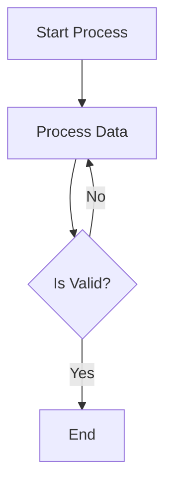

### Sequence Diagram Basic Syntax

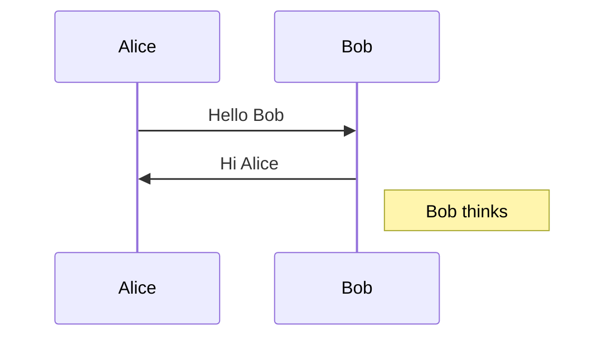

### Class Diagram Basic Syntax

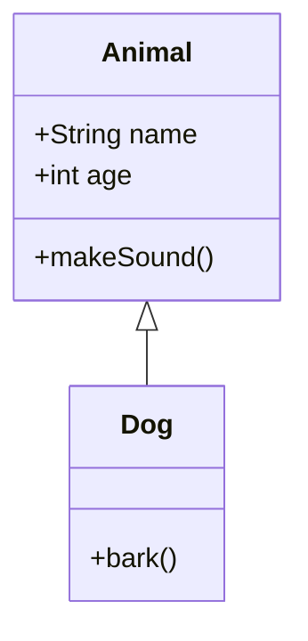

---

## Critical Rules (MUST FOLLOW)

### Rule 1: Special Characters in Labels

**Problem characters:** `:`, `()`, `[]`, `{}`, `@`, `;`, `,`

**Solutions:**

**Option A: Use double quotes**
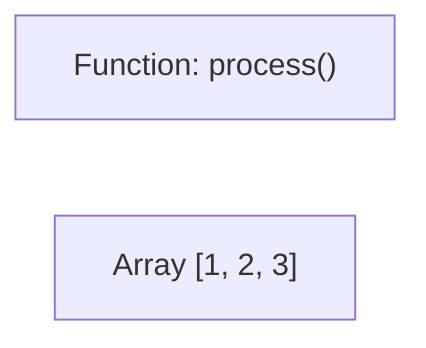

**Option B: Use HTML entities**
- `:` → `&#58;`
- `(` → `&#40;`
- `)` → `&#41;`
- `[` → `&#91;`
- `]` → `&#93;`
- `;` → `&#59;`

**WRONG:**
```mermaid
flowchart LR
    A[Function: process()]  ❌ Colon breaks syntax
```

---

### Rule 2: Reserved Words

**"end" (lowercase):**
```mermaid
flowchart TD
    Start --> End   ✅ Capitalized OK
    Start --> end   ❌ Breaks diagram
    Start --> END   ✅ All caps OK
```

**"o" and "x" at edge start:**
```mermaid
flowchart LR
    A --- oB  ❌ Creates circle edge
    A --- xB  ❌ Creates cross edge
    A --- oC  ✅ Add space: o B
```

---

### Rule 3: Subgraph Syntax

**CORRECT:**
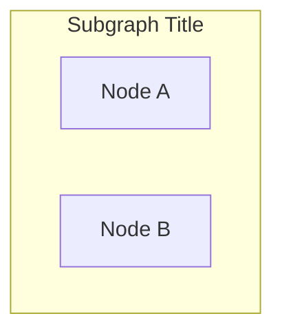

**WRONG:**
```mermaid
flowchart TD
    subgraph "Subgraph Title"  ❌ Missing ID
        A[Node A]
    end
```

---

### Rule 4: Note Syntax (Diagram-Specific)

**sequenceDiagram ONLY:**
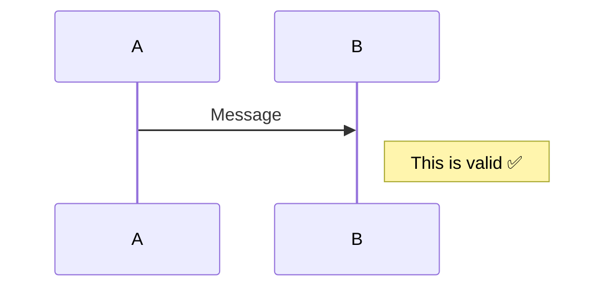

**flowchart/graph: NO note keyword**
```mermaid
flowchart TD
    Note[Use regular node instead]  ✅
```

---

### Rule 5: classDiagram Rules

**Define before linking:**
```mermaid
classDiagram
    class Animal {
        +name
    }
    class Dog

    Animal <|-- Dog  ✅ Both defined
```

**Method syntax:**
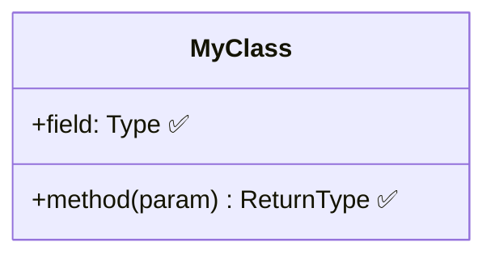

---

## Diagram Types

### Flowchart / Graph

**Declaration:**
- `flowchart TD` (Top-Down)
- `flowchart LR` (Left-Right)
- `graph TD` (alias)

**Node shapes:**
- `A[Rectangle]`
- `B(Rounded)`
- `C{Diamond}`
- `D([Stadium])`
- `E[[Subroutine]]`

**Edges:**
- `A --> B` (arrow)
- `A --- B` (line)
- `A -.-> B` (dotted arrow)
- `A ==> B` (thick arrow)
- `A -->|label| B` (labeled edge)

**Subgraph:**
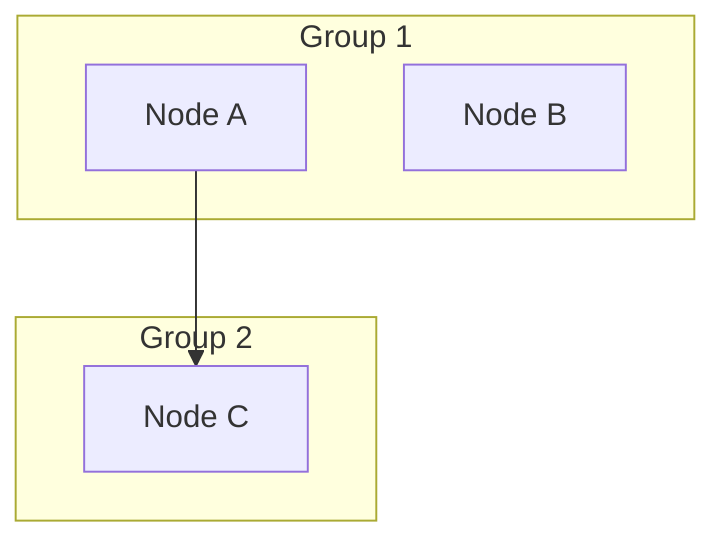

---

### sequenceDiagram

**Participants:**
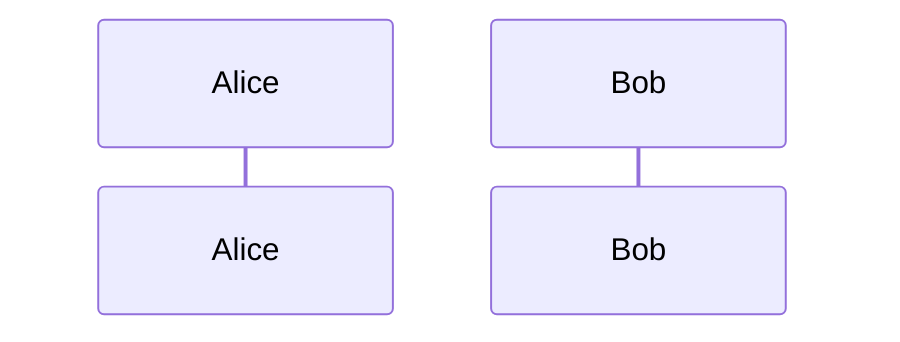

**Messages:**
- `A->>B: Solid arrow`
- `A-->>B: Dotted arrow`
- `A-)B: Async`

**Notes:**
- `Note right of A: Text`
- `Note left of B: Text`
- `Note over A,B: Text`

**Blocks:**
- `alt`, `opt`, `par`, `loop`, `rect`

---

### classDiagram

**Class definition:**
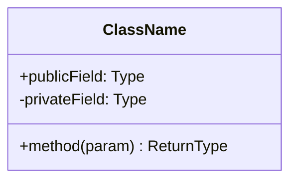

**Relationships:**
- `A <|-- B` (inheritance)
- `A *-- B` (composition)
- `A o-- B` (aggregation)
- `A --> B` (association)
- `A ..> B` (dependency)
- `A ..|> B` (realization)

**Edge labels:**
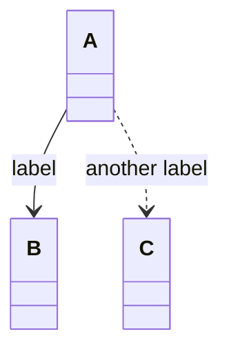

---

### stateDiagram-v2

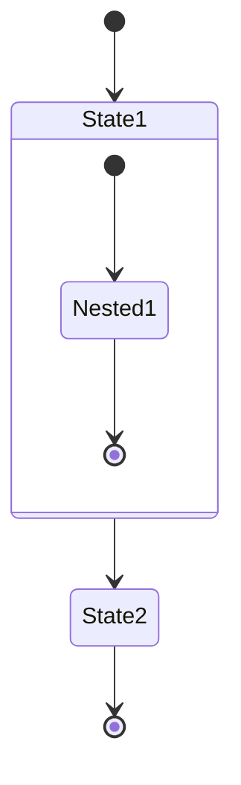

---

### erDiagram

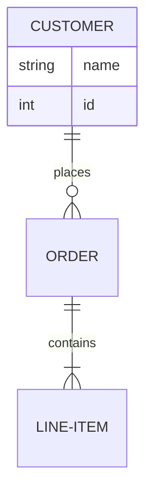

---

### gantt

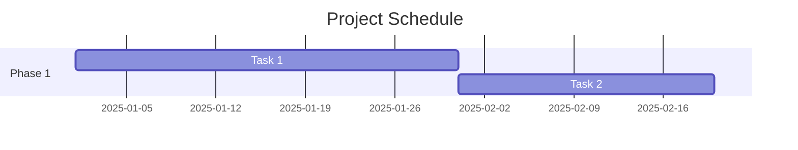

---

### mindmap

```mermaid
mindmap
  root((Central Idea))
    Topic1
      Subtopic1
      Subtopic2
    Topic2
```

---

## Common Errors and Solutions

### Error 1: "Parse error on line X"

**Cause:** Special characters in labels

**Solution:** Use double quotes or HTML entities
```mermaid
flowchart LR
    A["Method: process()"]  ✅
```

---

### Error 2: "Subgraph X not found"

**Cause:** Missing ID in subgraph declaration

**Solution:**
```mermaid
flowchart TD
    subgraph ID["Title"]  ✅
        A[Node]
    end
```

---

### Error 3: "Syntax error in graph"

**Cause:** Reserved word "end" in lowercase

**Solution:** Capitalize: `End`, `END`

---

### Error 4: "Note is not defined"

**Cause:** Using `Note` keyword in flowchart

**Solution:** Use regular node or switch to sequenceDiagram

---

### Error 5: Unexpected edge type

**Cause:** "o" or "x" at edge start

**Solution:**
```mermaid
flowchart LR
    A --- B  ✅
    A --- oC  ❌ (creates circle edge)
    A --- " oC"  ✅ (add space)
```

---

## Validation Checklist

Before finalizing a mermaid diagram:

- [ ] No special characters without quotes/escaping
- [ ] No lowercase "end" as node name
- [ ] Subgraphs have ID: `subgraph ID["Title"]`
- [ ] Note only in sequenceDiagram
- [ ] All referenced nodes are defined (classDiagram)
- [ ] No "o" or "x" at edge start in flowchart
- [ ] Proper diagram type declaration

---

## Best Practices

1. **Keep it simple:** Start with basic syntax, add complexity only if needed
2. **Use double quotes:** For any label with special characters
3. **Test incrementally:** Add nodes/edges one at a time if diagram is complex
4. **Consistent naming:** Use clear, descriptive IDs
5. **Avoid nesting:** Deep nesting often causes issues

---

## Quick Reference

**Escape special chars:** Use `"` or `&#XX;`
**Subgraph:** `subgraph ID["Title"]`
**Note:** sequenceDiagram only
**Reserved:** Avoid lowercase "end"
**classDiagram:** Define before link
