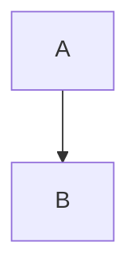

# Diagrams Skills Discovery

Provides automatic access to comprehensive Mermaid.js diagram skills for visual documentation.

## When This Skill Activates

This skill auto-activates when you're working with:
- Process flows and flowcharts
- Sequence and interaction diagrams
- System architecture and C4 diagrams
- Database schemas and ER diagrams
- Class diagrams and state machines
- Data visualization charts
- Project timelines and Gantt charts
- Git workflows and branching
- Mindmaps and concept hierarchies
- Any Mermaid.js diagram creation

## Available Skills

### Quick Reference

The diagrams category contains 8 specialized Mermaid.js skills:

1. **mermaid-flowcharts** - Process flows, decision trees, node shapes, subgraphs
2. **mermaid-sequence-diagrams** - Interactions, message flows, participants, lifelines
3. **mermaid-class-state-diagrams** - UML classes, relationships, state machines, FSM
4. **mermaid-er-diagrams** - Entity-relationship, database schemas, cardinality
5. **mermaid-architecture-diagrams** - C4 diagrams, block diagrams, system design
6. **mermaid-charts** - Pie, XY, quadrant, radar charts for data visualization
7. **mermaid-project-diagrams** - Gantt charts, timelines, project planning
8. **mermaid-specialized** - Git graphs, Sankey flows, mindmaps, requirement diagrams

## Common Workflows

### Document REST API
**Sequence**: Architecture → Sequence → ER

### Document Feature Implementation
**Sequence**: Flowchart → Sequence → State

### Project Planning
**Sequence**: Mindmap → Gantt → Timeline

### System Architecture Documentation
**Sequence**: C4 Context → C4 Container → Sequence

### Database Design
**Sequence**: ER → Class

## Diagram Selection Guide

**Process & Logic:**
- **Flowchart**: Algorithms, workflows, decision trees
- **Sequence**: API calls, protocols, service communication
- **State**: Lifecycle management, FSM, protocol states

**Structure & Design:**
- **Class**: Object models, API structure, OOP design
- **ER**: Database schema, data relationships
- **Architecture**: System topology, infrastructure, C4 diagrams

**Data & Metrics:**
- **Pie**: Distribution percentages, market share
- **XY Charts**: Trends over time, performance metrics
- **Quadrant**: Prioritization matrices, risk assessment
- **Radar**: Skill assessments, feature comparison
- **Sankey**: Flow analysis, conversion funnels

**Planning & History:**
- **Gantt**: Project schedules, task dependencies
- **Timeline**: Product roadmaps, company history
- **GitGraph**: Branching strategies, release workflows

**Ideation:**
- **Mindmap**: Brainstorming, concept hierarchies, learning paths

## Integration with Other Skills

Diagram skills commonly combine with:

**API skills**: Sequence diagrams for API interactions, ER diagrams for data models, Architecture diagrams for system design

**Database skills**: ER diagrams for schema design, Sequence diagrams for query patterns, Flowcharts for migration processes

**Testing skills**: Flowcharts for test scenarios, Sequence diagrams for test flows, State diagrams for state-based testing

**Frontend skills**: Flowcharts for user flows, State diagrams for UI state management, Sequence diagrams for data fetching

**Infrastructure skills**: Architecture diagrams for deployment, Sequence diagrams for CI/CD pipelines, Gantt charts for migration schedules

## Best Practices

1. **Start broad, drill down**: Architecture → Sequence → Class → Flowchart
2. **One diagram, one purpose**: Don't mix abstraction levels
3. **Label everything**: Relationships, transitions, axes, values
4. **Limit complexity**: Split large diagrams into focused views
5. **Use GitHub/GitLab rendering**: Diagrams auto-render in markdown
6. **Iterate in https://mermaid.live**: Fast feedback loop

## Mermaid.js Quick Tips

**In Markdown files**:
````markdown

````

**Live Preview**:
- https://mermaid.live - Official editor
- VS Code: Install "Mermaid Preview" extension
- GitHub/GitLab: Auto-renders in README.md

**Common Gotchas**:
- Use quotes for labels with spaces: `A["Label with spaces"]`
- Escape special characters in labels
- Check syntax highlighting for errors
- Start simple, add complexity incrementally
