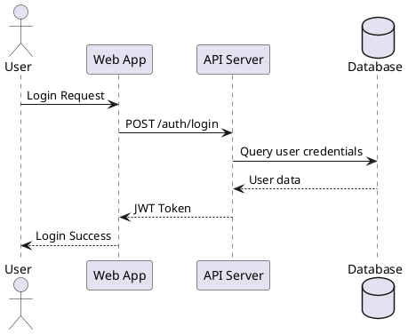
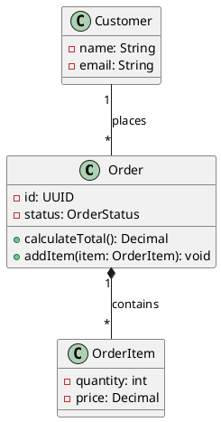
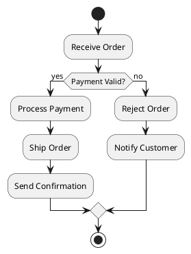
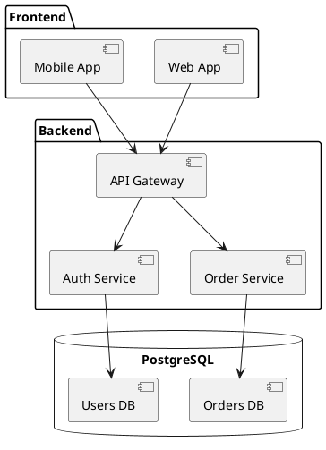
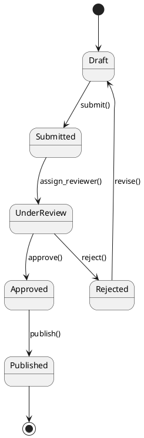
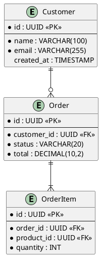

# PlantUML Diagram Generation and Conversion

This skill provides comprehensive capabilities for creating and converting PlantUML diagrams.

## Core Capabilities

1. **Diagram Creation** - Generate diagrams from natural language descriptions
2. **Source Code Visualization** - Convert Spring Boot, FastAPI, Python ETL, Node.js, and React architectures
3. **File Conversion** - Transform standalone `.puml` files to PNG or SVG formats
4. **Markdown Processing** - Extract PlantUML code blocks and linked files from markdown
5. **Syntax Validation** - Check PlantUML syntax without conversion
6. **Publication Support** - Prepare documents for Confluence and Notion

## Supported Diagram Types

### UML Diagrams
- Sequence diagrams
- Class diagrams
- Activity diagrams
- State diagrams
- Component diagrams
- Deployment diagrams
- Use case diagrams
- Object diagrams
- Timing diagrams

### Non-UML Diagrams
- ER diagrams
- Gantt charts
- Mindmaps
- WBS (Work Breakdown Structure)
- JSON/YAML visualization
- Network diagrams
- Archimate diagrams
- Wireframes

## Prerequisites

- Java JRE/JDK 8 or later
- plantuml.jar (placed in home directory or configured via `PLANTUML_JAR`)
- Graphviz (optional, for complex layouts)

## Key Workflows

### Resilient 4-Step Approach

1. **Identify** diagram type and load relevant reference
2. **Create** `.puml` file with structured naming convention
3. **Convert** with error handling (max 3 retries)
4. **Validate** output and integrate

### Markdown Processing

**CRITICAL for Confluence/Notion:** Run conversion FIRST before upload if markdown contains PlantUML diagrams.

## Basic Syntax Examples

### Sequence Diagram



### Class Diagram



### Activity Diagram



### Component Diagram



### State Diagram



### ER Diagram



## Styling

### Modern CSS-like Syntax

```plantuml
@startuml
<style>
  classDiagram {
    BackgroundColor #f5f5f5
    FontColor #333
  }
  class {
    BackgroundColor #e3f2fd
    BorderColor #1976d2
    FontColor #0d47a1
  }
</style>

class MyClass {
  +attribute: String
  +method(): void
}
@enduml
```



### Skinparam (Legacy)

```plantuml
@startuml
skinparam backgroundColor #ffffff
skinparam classBorderColor #333333
skinparam classBackgroundColor #e8e8e8
skinparam sequenceArrowThickness 2
skinparam roundcorner 10
@enduml
```

## Common Symbols and Icons

### Participants (Sequence)
- `actor` - Stick figure
- `participant` - Box
- `boundary` - UI boundary
- `control` - Process circle
- `entity` - Data entity
- `database` - Cylinder
- `collections` - Stacked boxes
- `queue` - Queue symbol

### Arrows
- `->` - Solid line
- `-->` - Dashed line
- `->>` - Solid with open arrow
- `-->>` - Dashed with open arrow
- `->x` - Lost message
- `<->` - Bidirectional

## Best Practices

1. **Use descriptive filenames** derived from diagram content
2. **Select PNG for web publishing**; SVG for scalable documentation
3. **Apply modern `<style>` syntax** for visual customization
4. **Test incrementally** before adding complexity
5. **Maintain `.puml` source files** for future edits
6. **Use includes** for shared styles: `!include common-styles.puml`
7. **Add notes** for complex relationships
8. **Group related elements** in packages/namespaces

## Conversion Commands

### Basic Conversion
```bash
java -jar plantuml.jar diagram.puml           # Creates PNG
java -jar plantuml.jar -tsvg diagram.puml     # Creates SVG
java -jar plantuml.jar -tpdf diagram.puml     # Creates PDF
```

### Batch Conversion
```bash
java -jar plantuml.jar -o output/ *.puml      # All files to output/
java -jar plantuml.jar -r "**/*.puml"         # Recursive
```

### Syntax Check Only
```bash
java -jar plantuml.jar -syntax diagram.puml
```

## Error Handling

Common errors and solutions:

1. **"Graphviz not found"** - Install Graphviz or use `-Djava.awt.headless=true`
2. **"Syntax error"** - Check for missing `@startuml`/`@enduml`
3. **"Unknown diagram type"** - Verify diagram keyword spelling
4. **"Memory error"** - Increase Java heap: `-Xmx1024m`

## Resources

- [PlantUML Official Documentation](https://plantuml.com/)
- [PlantUML Language Reference](https://plantuml.com/sitemap-language-specification)
- [PlantUML Online Server](https://www.plantuml.com/plantuml/uml/)
- [Real World PlantUML](https://real-world-plantuml.com/)
