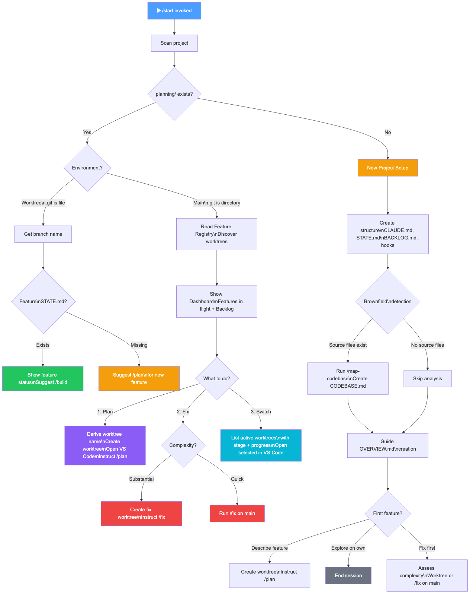
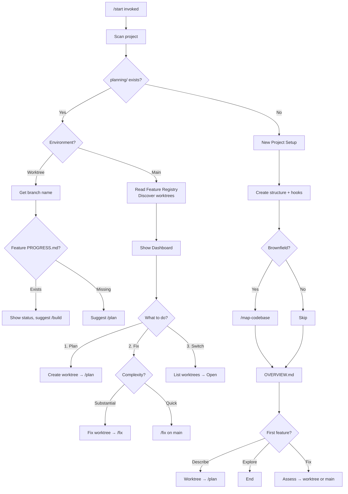
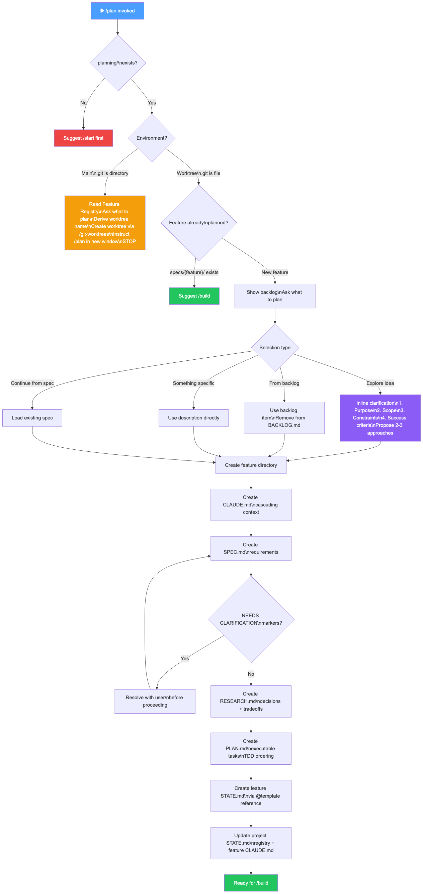
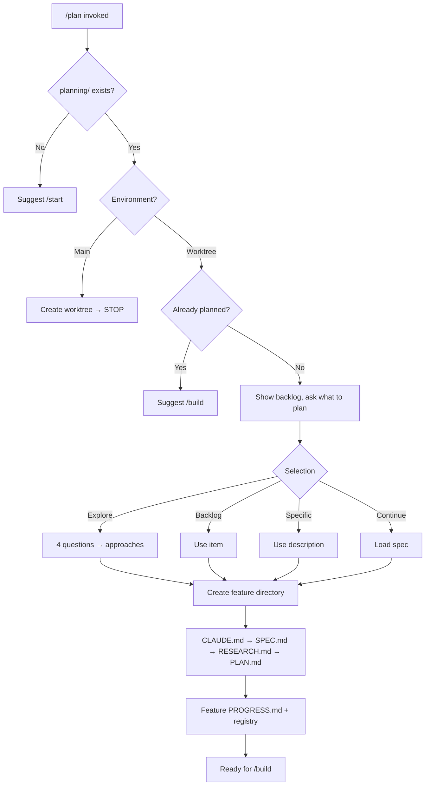
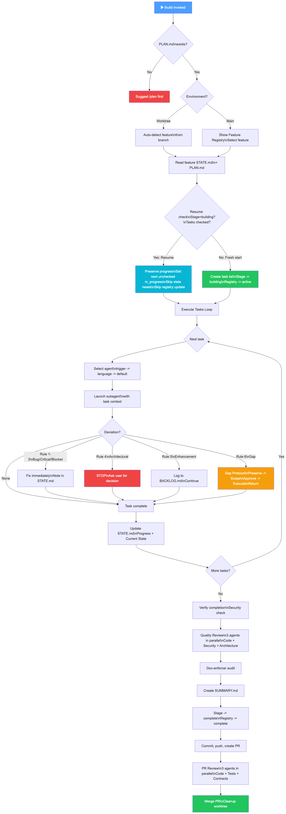
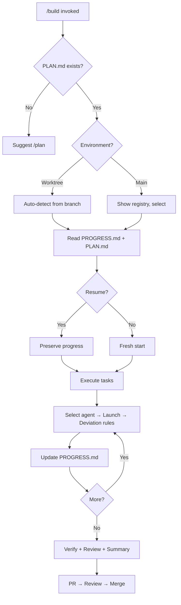
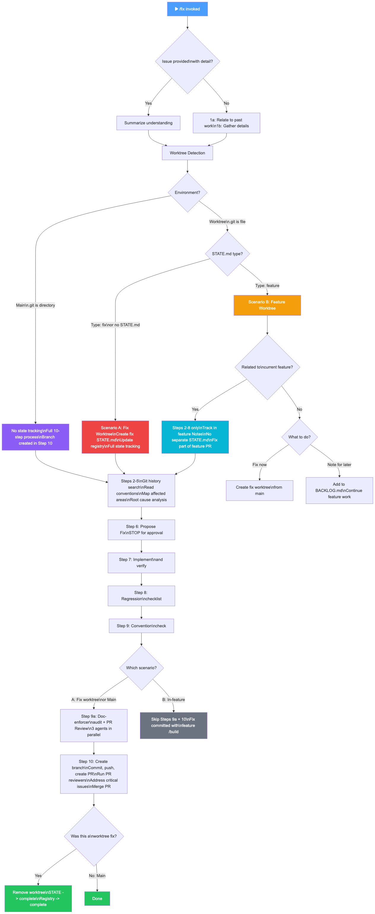
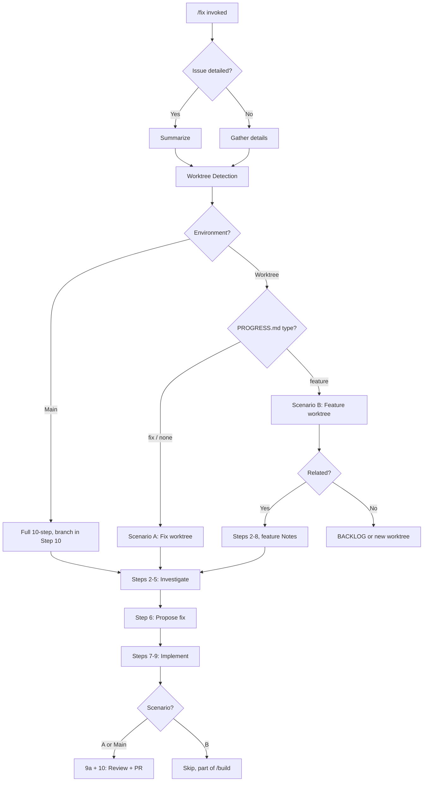

# Workflow Scenario Maps

Visual maps of every decision point and path through each workflow command.

## /start - Entry Point and Routing Hub

**Role**: /start serves three jobs:

1. **Initialize** - Set up planning structure for new projects
2. **Orient** - Show current state (what's in flight, what's available)
3. **Route** - Direct to the right next action (/plan, /fix, /build, or switch worktree)

/start never does implementation work. It reads state and routes to the appropriate workflow.



### Scenarios

| Entry State | Path | Outcome |
|---|---|---|
| No planning/ directory | New project setup | Structure created, OVERVIEW.md guided, first feature offered |
| Worktree + feature PROGRESS.md | Resume | Shows status, suggests /build |
| Worktree + no PROGRESS.md | New feature | Suggests /plan |
| Main branch | Dashboard | Shows features in flight + backlog, offers Plan/Fix/Switch |

### Main Branch Options

| Option | Action | Result |
|---|---|---|
| 1. Plan a feature | Derive name, create worktree, open VS Code | User runs /plan in new window |
| 2. Fix an issue | Assess complexity | Substantial: fix worktree + /fix. Quick: /fix on main |
| 3. Switch to worktree | List active worktrees with stage + progress | Opens selected worktree in VS Code |

### New Project Lifecycle

```
/start → Create structure → Brownfield detection → OVERVIEW.md → First feature?
  → Describe feature → Create worktree → /plan
  → Explore on own → End
  → Fix first → Assess → worktree or /fix on main
```

### Mermaid Source



---

## /plan - Specification and Planning

**Role**: Create complete feature specification and executable plan. Worktree-only workflow (redirects to worktree creation if on main).



### Scenarios

| Entry State | Path | Outcome |
|---|---|---|
| No planning/ | Error | Suggest /start |
| Main branch | Redirect | Create worktree, instruct /plan in new window, STOP |
| Worktree + already planned | Skip | Suggest /build |
| Worktree + new feature | Plan | Full planning flow |

### Planning Flow

```
Backlog → Selection → Clarify (if needed) → Create directory
  → CLAUDE.md → SPEC.md → Validate → RESEARCH.md → PLAN.md
  → Feature PROGRESS.md → Update registry → Ready for /build
```

### Selection Types

| Type | Flow |
|---|---|
| Explore idea | 4 questions (purpose, scope, constraints, success) → 2-3 approaches |
| From backlog | Use item, remove from backlog |
| Something specific | Use description directly |
| Continue from spec | Load existing spec |

### Mermaid Source



---

## /build - Plan Execution

**Role**: Execute the plan with subagent delegation, deviation rules, and quality gates. Handles both fresh starts and resume from interrupted sessions.



### Scenarios

| Entry State | Path | Outcome |
|---|---|---|
| No PLAN.md | Error | Suggest /plan |
| Worktree | Auto-detect | Feature from branch name |
| Main + multiple features | Select | Show registry, user picks |
| Stage=building + tasks checked | Resume | Preserve progress, continue |
| Stage=planning or ready | Fresh | Create task list, set building |

### Deviation Rules

| Rule | Trigger | Action | Blocks? |
|---|---|---|---|
| 1. Bug | Wrong output, failed test | Auto-fix, note in PROGRESS.md | No |
| 2. Critical | Security/correctness gap | Auto-add, note in PROGRESS.md | No |
| 3. Blocker | Missing dep, bad import | Auto-fix, note in PROGRESS.md | No |
| 4. Architectural | Technology/scope/structure change | STOP, ask user | Yes |
| 5. Enhancement | Nice-to-have idea | Log to BACKLOG.md | No |
| 6. Gap | Plan ordering issue | Gap Protocol | Depends |

### Completion Flow

```
All tasks complete → Verify + Security check
  → Quality Review (3 agents: Code + Security + Architecture)
  → Doc-enforcer audit
  → Create SUMMARY.md
  → Update state → complete
  → Commit, push, create PR
  → PR Review (3 agents: Code + Tests + Contracts)
  → Merge PR, cleanup worktree
```

### Mermaid Source



---

## /fix - Issue Resolution

**Role**: Thorough fix workflow with git history, root cause analysis, and regression prevention. Three distinct scenarios based on context.



### Scenarios

| Entry State | Scenario | State Tracking | Steps | Completion |
|---|---|---|---|---|
| Fix worktree (Type: fix or no PROGRESS.md) | A | Full fix PROGRESS.md | 1-10 | Branch + PR + merge + cleanup |
| Feature worktree (Type: feature), related | B (related) | Feature Notes section | 2-8 only | Part of feature /build |
| Feature worktree, unrelated | B (unrelated) | None | N/A | BACKLOG or new worktree |
| Main branch | Main | None | 1-10 | Branch + PR + merge |

### Investigation Flow (All Scenarios)

```
Git history → Conventions → Map affected areas → Root cause analysis
  → Propose fix (STOP for approval)
  → Implement → Regression checklist → Convention check
```

### Completion Flow (Scenario A + Main)

```
Step 9a: Doc-enforcer + PR Review (3 agents)
Step 10: Create branch → Commit → Push → PR → Review → Merge
  Worktree: + Remove worktree + Update STATE → complete
```

### In-Feature Fix (Scenario B-related)

```
Steps 2-8 only → Track in feature PROGRESS.md Notes
Skip Steps 9a + 10 → Fix committed with feature /build
```

### Mermaid Source


