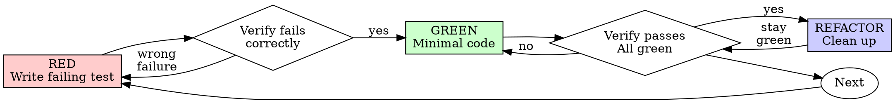

# Test-Driven Development (TDD)

## Overview

Write the test first. Watch it fail. Write minimal code to pass.

**Core principle:** If you didn't watch the test fail, you don't know if it tests the right thing.

**Violating the letter of the rules is violating the spirit of the rules.**

## When to Use

**Always:**

- New features
- Bug fixes
- Refactoring
- Behavior changes

**Exceptions (ask your human partner):**

- Throwaway prototypes
- Generated code
- Configuration files

Thinking "skip TDD just this once"? Stop. That's rationalization.

## The Iron Law

```
NO PRODUCTION CODE WITHOUT A FAILING TEST FIRST
```

Write code before the test? Delete it. Start over.

**No exceptions:**

- Don't keep it as "reference"
- Don't "adapt" it while writing tests
- Don't look at it
- Delete means delete

Implement fresh from tests. Period.

## Red-Green-Refactor



### RED - Write Failing Test

Write one minimal test showing what should happen.

<Good>
```typescript
test('retries failed operations 3 times', async () => {
  let attempts = 0;
  const operation = () => {
    attempts++;
    if (attempts < 3) throw new Error('fail');
    return 'success';
  };

  const result = await retryOperation(operation);

  expect(result).toBe('success');
  expect(attempts).toBe(3);
});

```
Clear name, tests real behavior, one thing
</Good>

<Bad>
```typescript
test('retry works', async () => {
  const mock = jest.fn()
    .mockRejectedValueOnce(new Error())
    .mockRejectedValueOnce(new Error())
    .mockResolvedValueOnce('success');
  await retryOperation(mock);
  expect(mock).toHaveBeenCalledTimes(3);
});
```

Vague name, tests mock not code
</Bad>

**Requirements:**

- One behavior
- Clear name
- Real code (no mocks unless unavoidable)

### Verify RED - Watch It Fail

**MANDATORY. Never skip.**

```bash
npm test path/to/test.test.ts
```

Confirm:

- Test fails (not errors)
- Failure message is expected
- Fails because feature missing (not typos)

**Test passes?** You're testing existing behavior. Fix test.

**Test errors?** Fix error, re-run until it fails correctly.

### GREEN - Minimal Code

Write simplest code to pass the test.

<Good>
```typescript
async function retryOperation<T>(fn: () => Promise<T>): Promise<T> {
  for (let i = 0; i < 3; i++) {
    try {
      return await fn();
    } catch (e) {
      if (i === 2) throw e;
    }
  }
  throw new Error('unreachable');
}
```
Just enough to pass
</Good>

<Bad>
```typescript
async function retryOperation<T>(
  fn: () => Promise<T>,
  options?: {
    maxRetries?: number;
    backoff?: 'linear' | 'exponential';
    onRetry?: (attempt: number) => void;
  }
): Promise<T> {
  // YAGNI
}
```
Over-engineered
</Bad>

Don't add features, refactor other code, or "improve" beyond the test.

### Verify GREEN - Watch It Pass

**MANDATORY.**

```bash
npm test path/to/test.test.ts
```

Confirm:

- Test passes
- Other tests still pass
- Output pristine (no errors, warnings)

**Test fails?** Fix code, not test.

**Other tests fail?** Fix now.

### REFACTOR - Clean Up

After green only:

- Remove duplication
- Improve names
- Extract helpers

Keep tests green. Don't add behavior.

### Repeat

Next failing test for next feature.

## Good Tests

| Quality | Good | Bad |
|---------|------|-----|
| **Minimal** | One thing. "and" in name? Split it. | `test('validates email and domain and whitespace')` |
| **Clear** | Name describes behavior | `test('test1')` |
| **Shows intent** | Demonstrates desired API | Obscures what code should do |

## Why Order Matters

**"I'll write tests after to verify it works"**

Tests written after code pass immediately. Passing immediately proves nothing:

- Might test wrong thing
- Might test implementation, not behavior
- Might miss edge cases you forgot
- You never saw it catch the bug

Test-first forces you to see the test fail, proving it actually tests something.

**"I already manually tested all the edge cases"**

Manual testing is ad-hoc. You think you tested everything but:

- No record of what you tested
- Can't re-run when code changes
- Easy to forget cases under pressure
- "It worked when I tried it" ≠ comprehensive

Automated tests are systematic. They run the same way every time.

**"Deleting X hours of work is wasteful"**

Sunk cost fallacy. The time is already gone. Your choice now:

- Delete and rewrite with TDD (X more hours, high confidence)
- Keep it and add tests after (30 min, low confidence, likely bugs)

The "waste" is keeping code you can't trust. Working code without real tests is technical debt.

**"TDD is dogmatic, being pragmatic means adapting"**

TDD IS pragmatic:

- Finds bugs before commit (faster than debugging after)
- Prevents regressions (tests catch breaks immediately)
- Documents behavior (tests show how to use code)
- Enables refactoring (change freely, tests catch breaks)

"Pragmatic" shortcuts = debugging in production = slower.

**"Tests after achieve the same goals - it's spirit not ritual"**

No. Tests-after answer "What does this do?" Tests-first answer "What should this do?"

Tests-after are biased by your implementation. You test what you built, not what's required. You verify remembered edge cases, not discovered ones.

Tests-first force edge case discovery before implementing. Tests-after verify you remembered everything (you didn't).

30 minutes of tests after ≠ TDD. You get coverage, lose proof tests work.

## Common Rationalizations

| Excuse | Reality |
|--------|---------|
| "Too simple to test" | Simple code breaks. Test takes 30 seconds. |
| "I'll test after" | Tests passing immediately prove nothing. |
| "Tests after achieve same goals" | Tests-after = "what does this do?" Tests-first = "what should this do?" |
| "Already manually tested" | Ad-hoc ≠ systematic. No record, can't re-run. |
| "Deleting X hours is wasteful" | Sunk cost fallacy. Keeping unverified code is technical debt. |
| "Keep as reference, write tests first" | You'll adapt it. That's testing after. Delete means delete. |
| "Need to explore first" | Fine. Throw away exploration, start with TDD. |
| "Test hard = design unclear" | Listen to test. Hard to test = hard to use. |
| "TDD will slow me down" | TDD faster than debugging. Pragmatic = test-first. |
| "Manual test faster" | Manual doesn't prove edge cases. You'll re-test every change. |
| "Existing code has no tests" | You're improving it. Add tests for existing code. |

## Red Flags - STOP and Start Over

- Code before test
- Test after implementation
- Test passes immediately
- Can't explain why test failed
- Tests added "later"
- Rationalizing "just this once"
- "I already manually tested it"
- "Tests after achieve the same purpose"
- "It's about spirit not ritual"
- "Keep as reference" or "adapt existing code"
- "Already spent X hours, deleting is wasteful"
- "TDD is dogmatic, I'm being pragmatic"
- "This is different because..."

**All of these mean: Delete code. Start over with TDD.**

## Example: Bug Fix

**Bug:** Empty email accepted

**RED**

```typescript
test('rejects empty email', async () => {
  const result = await submitForm({ email: '' });
  expect(result.error).toBe('Email required');
});
```

**Verify RED**

```bash
$ npm test
FAIL: expected 'Email required', got undefined
```

**GREEN**

```typescript
function submitForm(data: FormData) {
  if (!data.email?.trim()) {
    return { error: 'Email required' };
  }
  // ...
}
```

**Verify GREEN**

```bash
$ npm test
PASS
```

**REFACTOR**
Extract validation for multiple fields if needed.

## Verification Checklist

Before marking work complete:

- [ ] Every new function/method has a test
- [ ] Watched each test fail before implementing
- [ ] Each test failed for expected reason (feature missing, not typo)
- [ ] Wrote minimal code to pass each test
- [ ] All tests pass
- [ ] Output pristine (no errors, warnings)
- [ ] Tests use real code (mocks only if unavoidable)
- [ ] Edge cases and errors covered

Can't check all boxes? You skipped TDD. Start over.

## When Stuck

| Problem | Solution |
|---------|----------|
| Don't know how to test | Write wished-for API. Write assertion first. Ask your human partner. |
| Test too complicated | Design too complicated. Simplify interface. |
| Must mock everything | Code too coupled. Use dependency injection. |
| Test setup huge | Extract helpers. Still complex? Simplify design. |

## Debugging Integration

Bug found? Write failing test reproducing it. Follow TDD cycle. Test proves fix and prevents regression.

Never fix bugs without a test.

## Final Rule

```
Production code → test exists and failed first
Otherwise → not TDD
```

No exceptions without your human partner's permission.

---

# Testing Anti-Patterns

## Overview

Tests must verify real behavior, not mock behavior. Mocks are a means to isolate, not the thing being tested.

**Core principle:** Test what the code does, not what the mocks do.

**Following strict TDD prevents these anti-patterns.**

## The Iron Laws

```
1. NEVER test mock behavior
2. NEVER add test-only methods to production classes
3. NEVER mock without understanding dependencies
```

## Anti-Pattern 1: Testing Mock Behavior

**The violation:**

```typescript
// ❌ BAD: Testing that the mock exists
test('renders sidebar', () => {
  render(<Page />);
  expect(screen.getByTestId('sidebar-mock')).toBeInTheDocument();
});
```

**Why this is wrong:**

- You're verifying the mock works, not that the component works
- Test passes when mock is present, fails when it's not
- Tells you nothing about real behavior

**your human partner's correction:** "Are we testing the behavior of a mock?"

**The fix:**

```typescript
// ✅ GOOD: Test real component or don't mock it
test('renders sidebar', () => {
  render(<Page />);  // Don't mock sidebar
  expect(screen.getByRole('navigation')).toBeInTheDocument();
});

// OR if sidebar must be mocked for isolation:
// Don't assert on the mock - test Page's behavior with sidebar present
```

### Gate Function

```
BEFORE asserting on any mock element:
  Ask: "Am I testing real component behavior or just mock existence?"

  IF testing mock existence:
    STOP - Delete the assertion or unmock the component

  Test real behavior instead
```

## Anti-Pattern 2: Test-Only Methods in Production

**The violation:**

```typescript
// ❌ BAD: destroy() only used in tests
class Session {
  async destroy() {  // Looks like production API!
    await this._workspaceManager?.destroyWorkspace(this.id);
    // ... cleanup
  }
}

// In tests
afterEach(() => session.destroy());
```

**Why this is wrong:**

- Production class polluted with test-only code
- Dangerous if accidentally called in production
- Violates YAGNI and separation of concerns
- Confuses object lifecycle with entity lifecycle

**The fix:**

```typescript
// ✅ GOOD: Test utilities handle test cleanup
// Session has no destroy() - it's stateless in production

// In test-utils/
export async function cleanupSession(session: Session) {
  const workspace = session.getWorkspaceInfo();
  if (workspace) {
    await workspaceManager.destroyWorkspace(workspace.id);
  }
}

// In tests
afterEach(() => cleanupSession(session));
```

### Gate Function

```
BEFORE adding any method to production class:
  Ask: "Is this only used by tests?"

  IF yes:
    STOP - Don't add it
    Put it in test utilities instead

  Ask: "Does this class own this resource's lifecycle?"

  IF no:
    STOP - Wrong class for this method
```

## Anti-Pattern 3: Mocking Without Understanding

**The violation:**

```typescript
// ❌ BAD: Mock breaks test logic
test('detects duplicate server', () => {
  // Mock prevents config write that test depends on!
  vi.mock('ToolCatalog', () => ({
    discoverAndCacheTools: vi.fn().mockResolvedValue(undefined)
  }));

  await addServer(config);
  await addServer(config);  // Should throw - but won't!
});
```

**Why this is wrong:**

- Mocked method had side effect test depended on (writing config)
- Over-mocking to "be safe" breaks actual behavior
- Test passes for wrong reason or fails mysteriously

**The fix:**

```typescript
// ✅ GOOD: Mock at correct level
test('detects duplicate server', () => {
  // Mock the slow part, preserve behavior test needs
  vi.mock('MCPServerManager'); // Just mock slow server startup

  await addServer(config);  // Config written
  await addServer(config);  // Duplicate detected ✓
});
```

### Gate Function

```
BEFORE mocking any method:
  STOP - Don't mock yet

  1. Ask: "What side effects does the real method have?"
  2. Ask: "Does this test depend on any of those side effects?"
  3. Ask: "Do I fully understand what this test needs?"

  IF depends on side effects:
    Mock at lower level (the actual slow/external operation)
    OR use test doubles that preserve necessary behavior
    NOT the high-level method the test depends on

  IF unsure what test depends on:
    Run test with real implementation FIRST
    Observe what actually needs to happen
    THEN add minimal mocking at the right level

  Red flags:
    - "I'll mock this to be safe"
    - "This might be slow, better mock it"
    - Mocking without understanding the dependency chain
```

## Anti-Pattern 4: Incomplete Mocks

**The violation:**

```typescript
// ❌ BAD: Partial mock - only fields you think you need
const mockResponse = {
  status: 'success',
  data: { userId: '123', name: 'Alice' }
  // Missing: metadata that downstream code uses
};

// Later: breaks when code accesses response.metadata.requestId
```

**Why this is wrong:**

- **Partial mocks hide structural assumptions** - You only mocked fields you know about
- **Downstream code may depend on fields you didn't include** - Silent failures
- **Tests pass but integration fails** - Mock incomplete, real API complete
- **False confidence** - Test proves nothing about real behavior

**The Iron Rule:** Mock the COMPLETE data structure as it exists in reality, not just fields your immediate test uses.

**The fix:**

```typescript
// ✅ GOOD: Mirror real API completeness
const mockResponse = {
  status: 'success',
  data: { userId: '123', name: 'Alice' },
  metadata: { requestId: 'req-789', timestamp: 1234567890 }
  // All fields real API returns
};
```

### Gate Function

```
BEFORE creating mock responses:
  Check: "What fields does the real API response contain?"

  Actions:
    1. Examine actual API response from docs/examples
    2. Include ALL fields system might consume downstream
    3. Verify mock matches real response schema completely

  Critical:
    If you're creating a mock, you must understand the ENTIRE structure
    Partial mocks fail silently when code depends on omitted fields

  If uncertain: Include all documented fields
```

## Anti-Pattern 5: Integration Tests as Afterthought

**The violation:**

```
✅ Implementation complete
❌ No tests written
"Ready for testing"
```

**Why this is wrong:**

- Testing is part of implementation, not optional follow-up
- TDD would have caught this
- Can't claim complete without tests

**The fix:**

```
TDD cycle:
1. Write failing test
2. Implement to pass
3. Refactor
4. THEN claim complete
```

## When Mocks Become Too Complex

**Warning signs:**

- Mock setup longer than test logic
- Mocking everything to make test pass
- Mocks missing methods real components have
- Test breaks when mock changes

**your human partner's question:** "Do we need to be using a mock here?"

**Consider:** Integration tests with real components often simpler than complex mocks

## TDD Prevents These Anti-Patterns

**Why TDD helps:**

1. **Write test first** → Forces you to think about what you're actually testing
2. **Watch it fail** → Confirms test tests real behavior, not mocks
3. **Minimal implementation** → No test-only methods creep in
4. **Real dependencies** → You see what the test actually needs before mocking

**If you're testing mock behavior, you violated TDD** - you added mocks without watching test fail against real code first.

## Quick Reference

| Anti-Pattern | Fix |
|--------------|-----|
| Assert on mock elements | Test real component or unmock it |
| Test-only methods in production | Move to test utilities |
| Mock without understanding | Understand dependencies first, mock minimally |
| Incomplete mocks | Mirror real API completely |
| Tests as afterthought | TDD - tests first |
| Over-complex mocks | Consider integration tests |

## Red Flags

- Assertion checks for `*-mock` test IDs
- Methods only called in test files
- Mock setup is >50% of test
- Test fails when you remove mock
- Can't explain why mock is needed
- Mocking "just to be safe"

## The Bottom Line

**Mocks are tools to isolate, not things to test.**

If TDD reveals you're testing mock behavior, you've gone wrong.

Fix: Test real behavior or question why you're mocking at all.
