# Diagrams - Complete Visual Documentation Skill

This is the **single source of truth** for all diagram creation. It consolidates strategy, syntax, styling, and format-specific guidance into one comprehensive resource.

---

## Table of Contents

1. [Strategy: Choosing the Right Diagram](#1-strategy-choosing-the-right-diagram)
2. [Mermaid: Syntax & Rules](#2-mermaid-syntax--rules)
3. [Mermaid: Styling & Design](#3-mermaid-styling--design)
4. [Mermaid: Diagram Types Reference](#4-mermaid-diagram-types-reference)
5. [PlantUML: Syntax & Conversion](#5-plantuml-syntax--conversion)
6. [Draw.io: XML Format & Enterprise Diagrams](#6-drawio-xml-format--enterprise-diagrams)
7. [Templates & Examples](#7-templates--examples)
8. [Quick Reference](#8-quick-reference)

---

# 1. Strategy: Choosing the Right Diagram

## Core Workflow

```
┌─────────────────────────────────────────────────────────────────┐
│  1. ANALYZE CONTEXT                                             │
│     What is the user trying to communicate? To whom?            │
├─────────────────────────────────────────────────────────────────┤
│  2. EXTRACT INFORMATION                                         │
│     Identify entities, relationships, flows, states, timelines  │
├─────────────────────────────────────────────────────────────────┤
│  3. SELECT DIAGRAM TYPE(S)                                      │
│     Match information type to optimal visual representation     │
├─────────────────────────────────────────────────────────────────┤
│  4. SELECT FORMAT                                               │
│     Mermaid (quick/embedded), PlantUML (powerful), Draw.io (PMP)│
├─────────────────────────────────────────────────────────────────┤
│  5. RENDER WITH PROPER SYNTAX & STYLING                         │
│     Apply format-specific rules and visual best practices       │
└─────────────────────────────────────────────────────────────────┘
```

## Quick Decision: What Are You Trying to Show?

| If you need to show... | Use this diagram | Format |
|------------------------|------------------|--------|
| Step-by-step process with decisions | **Flowchart** | Mermaid |
| How components interact over time | **Sequence Diagram** | Mermaid/PlantUML |
| Object/class structure & relationships | **Class Diagram** | Mermaid/PlantUML |
| Database tables & relationships | **ER Diagram** | Mermaid |
| Object lifecycle/status transitions | **State Diagram** | Mermaid/PlantUML |
| System components at different zoom levels | **C4 Model** | Mermaid |
| High-level system overview for executives | **C4 Context** | Mermaid |
| Technology choices & deployments | **C4 Container** | Mermaid |
| Physical/cloud deployment | **Deployment Diagram** | PlantUML/Mermaid |
| Business process with roles | **Swimlane/BPMN** | Draw.io |
| User interactions with system | **Use Case Diagram** | PlantUML |
| Hierarchical breakdown | **Mind Map / WBS** | Mermaid/Draw.io |
| Project timeline with dependencies | **Gantt Chart** | Mermaid/Draw.io |
| Data transformation pipeline | **Data Flow Diagram** | Mermaid |
| PMP/PMBOK project management | **WBS, RACI, Risk Matrix** | Draw.io |

## Format Selection Guide

| Format | Best For | Native In | Strengths |
|--------|----------|-----------|-----------|
| **Mermaid** | Quick diagrams, docs | GitHub, Notion, VSCode | Browser-native, no install |
| **PlantUML** | Complex UML, formal docs | Confluence, IntelliJ | Powerful syntax, PNG/SVG export |
| **Draw.io** | Enterprise, PMP, editable | Desktop app, web | PMBOK templates, visual editing |

## Diagram Chaining Guide

### For Comprehensive System Documentation
```
Level 1: C4 Context
    ↓
Level 2: C4 Container (one per system)
    ↓
Level 3: C4 Component (one per complex container)
    ↓
Supporting diagrams:
├── Sequence Diagrams (per major use case)
├── ER Diagram (data model)
├── State Diagrams (per stateful entity)
└── Deployment Diagram (infrastructure)
```

### For Feature Specification
```
1. Use Case Diagram (what can users do?)
    ↓
2. Sequence Diagram (how does each use case work?)
    ↓
3. Class/ER Diagram (what data is involved?)
    ↓
4. State Diagram (if entity has lifecycle)
```

### For API Documentation
```
1. C4 Container (show API in context)
    ↓
2. Sequence Diagrams (per endpoint group)
    ↓
3. Class Diagram (request/response types)
```

---

# 2. Mermaid: Syntax & Rules

## Critical Rules (MUST FOLLOW)

### Rule 1: Special Characters in Labels

**Problem characters:** `:`, `()`, `[]`, `{}`, `@`, `;`, `,`

**Solution A: Use double quotes**
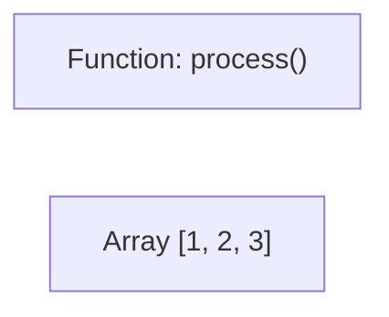

**Solution B: Use HTML entities**
- `:` → `&#58;`
- `(` → `&#40;`
- `)` → `&#41;`
- `[` → `&#91;`
- `]` → `&#93;`
- `;` → `&#59;`

**WRONG:**
```mermaid
flowchart LR
    A[Function: process()]  ❌ Colon breaks syntax
```

### Rule 2: Reserved Words

**"end" (lowercase):**
```mermaid
flowchart TD
    Start --> End   ✅ Capitalized OK
    Start --> end   ❌ Breaks diagram
    Start --> END   ✅ All caps OK
```

**"o" and "x" at edge start:**
```mermaid
flowchart LR
    A --- oB  ❌ Creates circle edge
    A --- xB  ❌ Creates cross edge
```

### Rule 3: Subgraph Syntax

**CORRECT:**
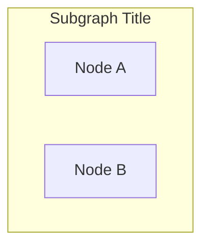

**WRONG:**
```mermaid
flowchart TD
    subgraph "Subgraph Title"  ❌ Missing ID
        A[Node A]
    end
```

### Rule 4: Note Syntax (Diagram-Specific)

**sequenceDiagram ONLY:**
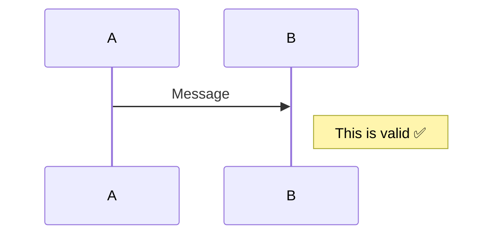

**flowchart/graph: NO note keyword**
```mermaid
flowchart TD
    Note[Use regular node instead]  ✅
```

### Rule 5: classDiagram Rules

**Define before linking:**
```mermaid
classDiagram
    class Animal {
        +name
    }
    class Dog

    Animal <|-- Dog  ✅ Both defined
```

## Validation Checklist

Before finalizing a mermaid diagram:

- [ ] No special characters without quotes/escaping
- [ ] No lowercase "end" as node name
- [ ] Subgraphs have ID: `subgraph ID["Title"]`
- [ ] Note only in sequenceDiagram
- [ ] All referenced nodes are defined (classDiagram)
- [ ] No "o" or "x" at edge start in flowchart
- [ ] Proper diagram type declaration

---

# 3. Mermaid: Styling & Design

## Core Principles

### 1. Visual Hierarchy Over Decoration
Use color, size, and styling to guide the eye to what matters most.

### 2. Semantic Color, Not Random Color
Colors should have meaning:
- Show grouping or categories
- Indicate state (success/error/warning)
- Highlight critical paths
- Distinguish layers

### 3. Simplicity Over Completeness
A diagram showing 80% clearly beats 100% confusingly. Split complex systems.

### 4. Readability First
If text is hard to read or layout is cramped, the diagram fails.

## Default: Dark Mode Colors

**Always use dark mode colors unless user explicitly requests light mode.**

## Shape Semantics

| Shape | Meaning | Syntax |
|-------|---------|--------|
| Rectangle | Standard components, services | `A[Label]` |
| Rounded | User-facing, APIs, interfaces | `A(Label)` |
| Circle/Ellipse | Start/end, external systems | `A((Label))` |
| Diamond | Decision points, gateways | `A{Label}` |
| Cylinder | Databases, data stores | `A[(Label)]` |
| Hexagon | Queues, message brokers | `A{{Label}}` |
| Stadium | Actions, events | `A([Label])` |

## Layout Guidelines

**Left-to-right (LR) when:**
- Sequential processes or pipelines
- Time flows left to right
- Architecture diagrams

**Top-to-bottom (TB) when:**
- Hierarchies or layers
- Flowcharts with decisions
- Natural reading flow

## Spacing and Density

**Aim for:** 7-12 nodes per diagram (human working memory limit)

**Techniques:**
- Break large diagrams into multiple focused ones
- Use subgraphs to organize
- Remove non-essential details

## Common Mistakes to Avoid

| Mistake | Fix |
|---------|-----|
| Too many colors (>5) | Use 3-4 semantic colors |
| Pure black lines | Use dark gray |
| Tiny text | Concise labels, line breaks |
| Every box same style | Highlight key components |
| Spaghetti crossing lines | Use subgraphs to group |
| Showing everything | Multiple focused diagrams |

---

# 4. Mermaid: Diagram Types Reference

## Flowchart / Graph

**Declaration:**
- `flowchart TD` (Top-Down)
- `flowchart LR` (Left-Right)

**Node shapes:**
- `A[Rectangle]`
- `B(Rounded)`
- `C{Diamond}`
- `D([Stadium])`
- `E[[Subroutine]]`
- `F[(Database)]`
- `G((Circle))`

**Edges:**
- `A --> B` (arrow)
- `A --- B` (line)
- `A -.-> B` (dotted arrow)
- `A ==> B` (thick arrow)
- `A -->|label| B` (labeled edge)

**Subgraph:**
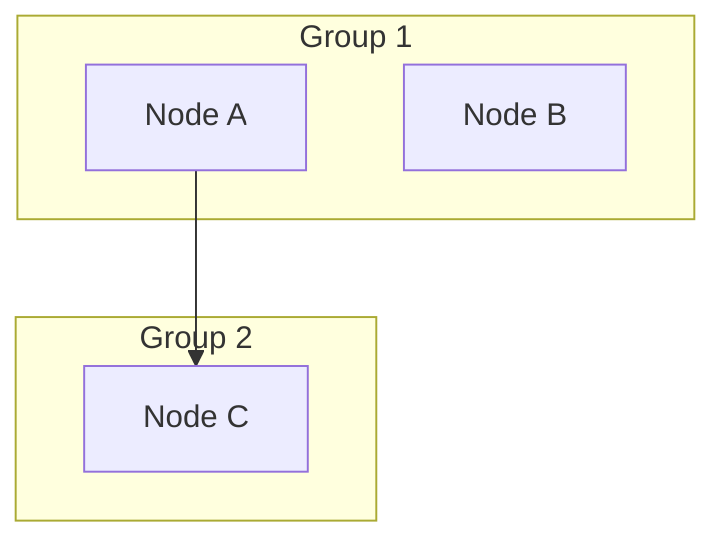

## Sequence Diagram

**Participants:**
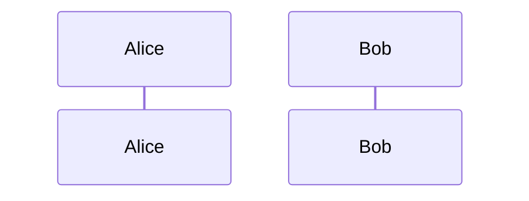

**Messages:**
- `A->>B: Solid arrow`
- `A-->>B: Dotted arrow`
- `A-)B: Async`

**Notes:**
- `Note right of A: Text`
- `Note left of B: Text`
- `Note over A,B: Text`

**Blocks:** `alt`, `opt`, `par`, `loop`, `rect`

## Class Diagram

**Class definition:**
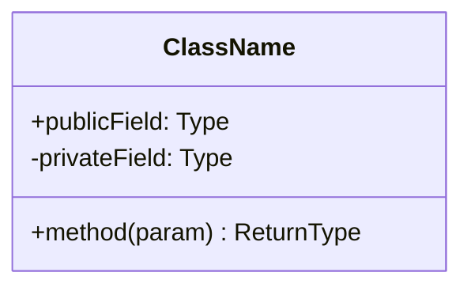

**Relationships:**
- `A <|-- B` (inheritance)
- `A *-- B` (composition)
- `A o-- B` (aggregation)
- `A --> B` (association)
- `A ..> B` (dependency)
- `A ..|> B` (realization)

## State Diagram

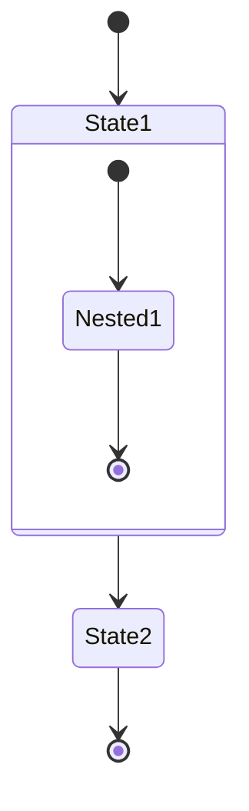

## ER Diagram

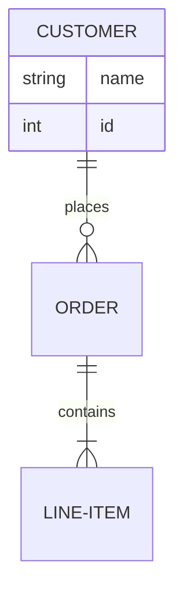

**Cardinality:**
- `||` Exactly one
- `|o` Zero or one
- `|{` One or more
- `o{` Zero or more

## Gantt Chart

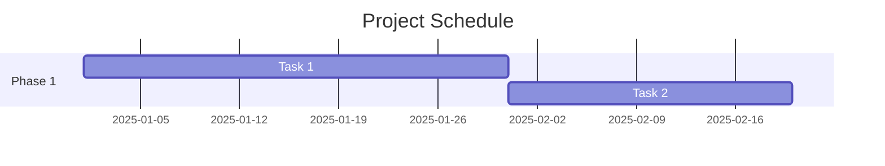

## Mind Map

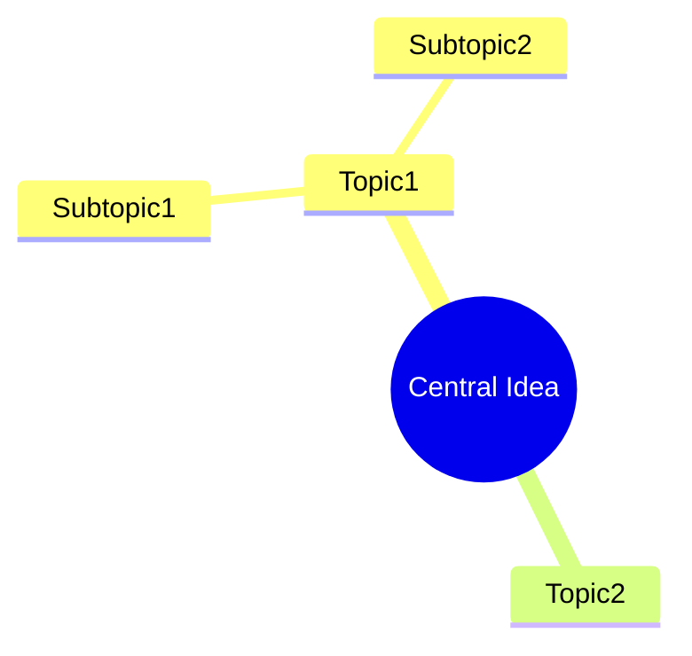

---

# 5. PlantUML: Syntax & Conversion

## When to Use PlantUML

- Complex UML diagrams
- Need PNG/SVG output
- Confluence/IntelliJ native support
- More powerful layout control

## Prerequisites

- Java JRE/JDK 8+
- plantuml.jar
- Graphviz (optional, for complex layouts)

## Basic Syntax Examples

### Sequence Diagram

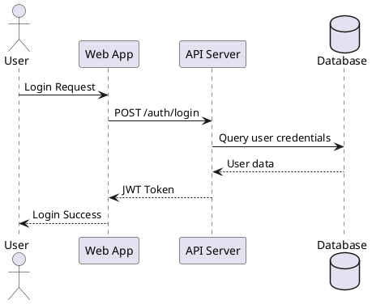

### Class Diagram

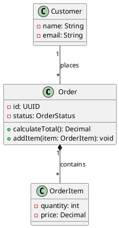

### Activity Diagram

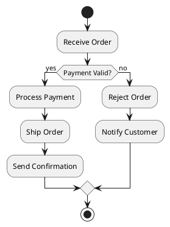

### Component Diagram

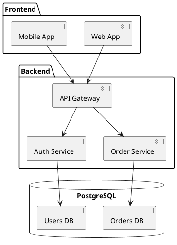

### State Diagram

```plantuml
@startuml
[*] --> Draft
Draft --> Submitted : submit()
Submitted --> UnderReview : assign_reviewer()
UnderReview --> Approved : approve()
UnderReview --> Rejected : reject()
Approved --> Published : publish()
Rejected --> Draft : revise()
Published --> [*]
@enduml
```

### ER Diagram

```plantuml
@startuml
entity Customer {
  * id : UUID <<PK>>
  --
  * name : VARCHAR(100)
  * email : VARCHAR(255)
  created_at : TIMESTAMP
}

entity Order {
  * id : UUID <<PK>>
  --
  * customer_id : UUID <<FK>>
  * status : VARCHAR(20)
  * total : DECIMAL(10,2)
}

Customer ||--o{ Order
@enduml
```

## Styling

### Modern CSS-like Syntax

```plantuml
@startuml
<style>
  classDiagram {
    BackgroundColor #f5f5f5
    FontColor #333
  }
  class {
    BackgroundColor #e3f2fd
    BorderColor #1976d2
    FontColor #0d47a1
  }
</style>

class MyClass {
  +attribute: String
  +method(): void
}
@enduml
```

### Skinparam (Legacy)

```plantuml
@startuml
skinparam backgroundColor #ffffff
skinparam classBorderColor #333333
skinparam classBackgroundColor #e8e8e8
skinparam sequenceArrowThickness 2
skinparam roundcorner 10
@enduml
```

## Common Symbols

### Participants (Sequence)
- `actor` - Stick figure
- `participant` - Box
- `boundary` - UI boundary
- `control` - Process circle
- `entity` - Data entity
- `database` - Cylinder
- `collections` - Stacked boxes
- `queue` - Queue symbol

### Arrows
- `->` - Solid line
- `-->` - Dashed line
- `->>` - Solid with open arrow
- `-->>` - Dashed with open arrow
- `->x` - Lost message
- `<->` - Bidirectional

## Conversion Commands

```bash
java -jar plantuml.jar diagram.puml           # Creates PNG
java -jar plantuml.jar -tsvg diagram.puml     # Creates SVG
java -jar plantuml.jar -tpdf diagram.puml     # Creates PDF
java -jar plantuml.jar -syntax diagram.puml   # Syntax check only
java -jar plantuml.jar -o output/ *.puml      # Batch to output/
```

## Error Handling

| Error | Solution |
|-------|----------|
| "Graphviz not found" | Install Graphviz or use `-Djava.awt.headless=true` |
| "Syntax error" | Check for missing `@startuml`/`@enduml` |
| "Unknown diagram type" | Verify diagram keyword spelling |
| "Memory error" | Increase Java heap: `-Xmx1024m` |

---

# 6. Draw.io: XML Format & Enterprise Diagrams

## When to Use Draw.io

- PMP/PMBOK project management diagrams
- Enterprise/formal documentation
- Visual editing needed
- Complex swimlanes/BPMN
- Risk matrices, RACI, WBS

## Core Capabilities

### Standard Diagram Types
- Flowcharts, Cross-Functional Flowcharts (Swimlanes)
- BPMN Diagrams
- UML Diagrams
- Network Diagrams
- Org Charts
- Mind Maps
- Entity Relationship Diagrams

### PMP/PMBOK Project Management
- Work Breakdown Structure (WBS)
- Project Network Diagrams (PERT, CPM)
- Gantt Charts
- RACI Matrices
- Risk Register Diagrams (heat maps, probability-impact)
- Stakeholder Maps (power-interest grids)
- Resource Histograms

## Draw.io File Format

Draw.io files are XML-based with `.drawio` extension:

```xml
<mxfile host="app.diagrams.net" modified="[timestamp]" agent="Claude" version="24.7.17">
  <diagram id="[unique-id]" name="Page-1">
    <mxGraphModel dx="1434" dy="759" grid="1" gridSize="10" guides="1" tooltips="1" connect="1" arrows="1" fold="1" page="1" pageScale="1" pageWidth="850" pageHeight="1100" math="0" shadow="0">
      <root>
        <mxCell id="0"/>
        <mxCell id="1" parent="0"/>
        <!-- Shapes and connectors go here -->
      </root>
    </mxGraphModel>
  </diagram>
</mxfile>
```

## Core Concepts

### Cells (mxCell)

**Basic Shape Cell:**
```xml
<mxCell id="2" value="Process Step" style="rounded=1;whiteSpace=wrap;html=1;fillColor=#dae8fc;strokeColor=#6c8ebf;" vertex="1" parent="1">
  <mxGeometry x="100" y="100" width="120" height="60" as="geometry"/>
</mxCell>
```

**Connector Cell:**
```xml
<mxCell id="3" style="edgeStyle=orthogonalEdgeStyle;rounded=0;orthogonalLoop=1;jettySize=auto;html=1;" edge="1" parent="1" source="2" target="4">
  <mxGeometry relative="1" as="geometry"/>
</mxCell>
```

### ID Management
- Each cell must have a unique ID
- Use sequential integers: "2", "3", "4", etc.
- IDs "0" and "1" are reserved for root cells

## Common Shape Styles

### Flowchart Shapes

**Process (Rectangle):**
```
rounded=1;whiteSpace=wrap;html=1;fillColor=#dae8fc;strokeColor=#6c8ebf;
```

**Decision (Diamond):**
```
rhombus;whiteSpace=wrap;html=1;fillColor=#ffe6cc;strokeColor=#d79b00;
```

**Start/End (Ellipse):**
```
ellipse;whiteSpace=wrap;html=1;fillColor=#d5e8d4;strokeColor=#82b366;
```

**Swimlane Container:**
```
swimlane;html=1;startSize=20;fillColor=#f5f5f5;strokeColor=#666666;fontStyle=1;
```

## Color Schemes

### Professional Blue Theme
- **Primary**: `fillColor=#dae8fc;strokeColor=#6c8ebf;`
- **Secondary**: `fillColor=#b1ddf0;strokeColor=#10739e;`
- **Accent**: `fillColor=#f8cecc;strokeColor=#b85450;`

### PMP Risk Matrix Colors
- **Critical**: `fillColor=#8B0000;strokeColor=#600000;fontColor=#ffffff;`
- **High**: `fillColor=#FF0000;strokeColor=#CC0000;fontColor=#ffffff;`
- **Medium**: `fillColor=#FFA500;strokeColor=#CC8400;fontColor=#000000;`
- **Low**: `fillColor=#FFFF00;strokeColor=#CCCC00;fontColor=#000000;`
- **Very Low**: `fillColor=#90EE90;strokeColor=#66AA66;fontColor=#000000;`

### PMBOK 5 Process Groups (Color Coding)
1. **Initiating**: Green (`#d5e8d4`)
2. **Planning**: Blue (`#dae8fc`)
3. **Executing**: Orange (`#ffe6cc`)
4. **Monitoring & Controlling**: Yellow (`#fff2cc`)
5. **Closing**: Purple (`#e1d5e7`)

## Connector Styles

```
edgeStyle=orthogonalEdgeStyle;rounded=0;orthogonalLoop=1;jettySize=auto;html=1;
```

**With Arrow:**
```
edgeStyle=orthogonalEdgeStyle;rounded=0;html=1;endArrow=classic;endFill=1;
```

**Dashed Line:**
```
edgeStyle=orthogonalEdgeStyle;rounded=0;html=1;dashed=1;dashPattern=5 5;
```

**Critical Path (Thick):**
```
edgeStyle=orthogonalEdgeStyle;rounded=0;html=1;strokeWidth=3;strokeColor=#b85450;
```

## Best Practices

### Layout Guidelines
- **Grid alignment**: Use x/y coordinates in multiples of 10
- **Standard spacing**: 20-30px between shapes, 40-50px between rows
- **Shape sizes**: Small: 80x40, Medium: 120x60, Large: 160x80

### Validation Checklist
- [ ] All IDs are unique
- [ ] Root cells (0, 1) exist
- [ ] All connectors have valid source/target
- [ ] Coordinates are positive numbers
- [ ] Style strings are properly formatted
- [ ] XML is well-formed

---

# 7. Templates & Examples

## System Architecture (Mermaid)

```mermaid
graph TB
    subgraph "Client Layer"
        Web[Web App]
        Mobile[Mobile App]
        CLI[CLI Tool]
    end

    subgraph "API Gateway Layer"
        Gateway[API Gateway<br/>Rate Limiting<br/>Authentication]
    end

    subgraph "Service Layer"
        Auth[Auth Service]
        User[User Service]
        Order[Order Service]
        Payment[Payment Service]
        Notification[Notification Service]
    end

    subgraph "Data Layer"
        UserDB[(User DB<br/>PostgreSQL)]
        OrderDB[(Order DB<br/>PostgreSQL)]
        Cache[(Redis Cache)]
        Queue[Message Queue<br/>RabbitMQ]
    end

    subgraph "External Services"
        Stripe[Stripe API]
        SendGrid[SendGrid]
        S3[AWS S3]
    end

    Web --> Gateway
    Mobile --> Gateway
    CLI --> Gateway

    Gateway --> Auth
    Gateway --> User
    Gateway --> Order
    Gateway --> Payment

    Auth --> UserDB
    User --> UserDB
    User --> Cache
    Order --> OrderDB
    Order --> Queue
    Payment --> Stripe
    Queue --> Notification
    Notification --> SendGrid

    Order --> S3
    User --> S3

    style Gateway fill:#ff6b6b
    style Auth fill:#4ecdc4
    style User fill:#4ecdc4
    style Order fill:#4ecdc4
    style Payment fill:#4ecdc4
    style Notification fill:#4ecdc4
```

## Sequence Diagram (Mermaid)

```mermaid
sequenceDiagram
    actor User
    participant Web as Web App
    participant Gateway as API Gateway
    participant Auth as Auth Service
    participant Order as Order Service
    participant Payment as Payment Service
    participant DB as Database
    participant Queue as Message Queue
    participant Email as Email Service

    User->>Web: Place Order
    Web->>Gateway: POST /orders
    Gateway->>Auth: Validate Token
    Auth-->>Gateway: Token Valid

    Gateway->>Order: Create Order
    Order->>DB: Save Order
    DB-->>Order: Order Saved
    Order->>Payment: Process Payment
    Payment->>Payment: Charge Card
    Payment-->>Order: Payment Success
    Order->>Queue: Publish Order Event
    Queue->>Email: Send Confirmation
    Email->>User: Order Confirmation

    Order-->>Gateway: Order Created
    Gateway-->>Web: 201 Created
    Web-->>User: Order Success

    Note over User,Email: Async email sent via queue
```

## C4 Context Diagram (Mermaid)

```mermaid
graph TB
    subgraph "E-Commerce System"
        System[E-Commerce Platform<br/>Manages products, orders,<br/>and customer accounts]
    end

    Customer[Customer<br/>Browses and purchases products]
    Admin[Administrator<br/>Manages products and orders]

    Email[Email System<br/>SendGrid]
    Payment[Payment Provider<br/>Stripe]
    Analytics[Analytics Platform<br/>Google Analytics]

    Customer -->|Browses, Orders| System
    Admin -->|Manages| System
    System -->|Sends emails| Email
    System -->|Processes payments| Payment
    System -->|Tracks events| Analytics

    style System fill:#1168bd
    style Customer fill:#08427b
    style Admin fill:#08427b
    style Email fill:#999
    style Payment fill:#999
    style Analytics fill:#999
```

## Component Diagram (Mermaid)

```mermaid
graph LR
    subgraph "Frontend"
        UI[React UI]
        Store[Redux Store]
        Router[React Router]
    end

    subgraph "API Layer"
        REST[REST API]
        WS[WebSocket]
        GQL[GraphQL]
    end

    subgraph "Business Logic"
        ProductSvc[Product Service]
        OrderSvc[Order Service]
        AuthSvc[Auth Service]
    end

    subgraph "Data Access"
        ProductRepo[Product Repository]
        OrderRepo[Order Repository]
        UserRepo[User Repository]
        Cache[Cache Layer]
    end

    subgraph "Infrastructure"
        DB[(PostgreSQL)]
        Redis[(Redis)]
        S3[AWS S3]
    end

    UI --> Store
    Store --> Router
    UI --> REST
    UI --> WS
    UI --> GQL

    REST --> ProductSvc
    REST --> OrderSvc
    REST --> AuthSvc
    WS --> OrderSvc
    GQL --> ProductSvc

    ProductSvc --> ProductRepo
    OrderSvc --> OrderRepo
    AuthSvc --> UserRepo

    ProductRepo --> DB
    OrderRepo --> DB
    UserRepo --> DB
    ProductRepo --> Cache
    Cache --> Redis
    ProductSvc --> S3
```

## Deployment Diagram (Mermaid)

```mermaid
graph TB
    subgraph "AWS Cloud"
        subgraph "VPC"
            subgraph "Public Subnet"
                ALB[Application<br/>Load Balancer]
                NAT[NAT Gateway]
            end

            subgraph "Private Subnet 1"
                ECS1[ECS Container<br/>Service Instance 1]
                ECS2[ECS Container<br/>Service Instance 2]
            end

            subgraph "Private Subnet 2"
                RDS1[(RDS Primary)]
                RDS2[(RDS Replica)]
            end

            subgraph "Private Subnet 3"
                ElastiCache[(ElastiCache<br/>Redis Cluster)]
            end
        end

        Route53[Route 53<br/>DNS]
        CloudFront[CloudFront CDN]
        S3[S3 Bucket<br/>Static Assets]
        ECR[ECR<br/>Container Registry]
    end

    Users[Users] --> Route53
    Route53 --> CloudFront
    CloudFront --> ALB
    CloudFront --> S3
    ALB --> ECS1
    ALB --> ECS2
    ECS1 --> RDS1
    ECS2 --> RDS1
    RDS1 --> RDS2
    ECS1 --> ElastiCache
    ECS2 --> ElastiCache
    ECS1 --> S3
    ECS2 --> S3
    ECS1 -.pulls images.-> ECR
    ECS2 -.pulls images.-> ECR

    style ALB fill:#ff6b6b
    style ECS1 fill:#4ecdc4
    style ECS2 fill:#4ecdc4
    style RDS1 fill:#95e1d3
    style RDS2 fill:#95e1d3
```

## Data Flow Diagram (Mermaid)

```mermaid
graph LR
    User[User Action] --> Frontend[Frontend App]
    Frontend --> Validation{Validation}
    Validation -->|Invalid| Error[Show Error]
    Validation -->|Valid| API[API Request]
    API --> Auth{Authenticated?}
    Auth -->|No| Unauthorized[401 Response]
    Auth -->|Yes| Service[Business Service]
    Service --> Database[(Database)]
    Service --> Cache[(Cache)]
    Cache -->|Hit| Return[Return Cached]
    Cache -->|Miss| Database
    Database --> Transform[Transform Data]
    Transform --> Response[API Response]
    Response --> Frontend
    Frontend --> Render[Render UI]
```

---

# 8. Quick Reference

## Mermaid Quick Reference

| Element | Syntax |
|---------|--------|
| Flowchart TB | `flowchart TD` |
| Flowchart LR | `flowchart LR` |
| Rectangle | `A[Label]` |
| Rounded | `A(Label)` |
| Diamond | `A{Label}` |
| Database | `A[(Label)]` |
| Circle | `A((Label))` |
| Arrow | `A --> B` |
| Dotted | `A -.-> B` |
| Labeled | `A -->|text| B` |
| Subgraph | `subgraph ID["Title"]` |
| Sequence participant | `participant A as Name` |
| Sequence message | `A->>B: Message` |
| Note | `Note right of A: Text` |
| Class | `class Name { +field }` |
| Inheritance | `A <|-- B` |
| ER relation | `A ||--o{ B : label` |

## PlantUML Quick Reference

| Element | Syntax |
|---------|--------|
| Start | `@startuml` |
| End | `@enduml` |
| Actor | `actor Name` |
| Participant | `participant "Name" as N` |
| Database | `database Name` |
| Message | `A -> B: Message` |
| Return | `A --> B: Response` |
| Class | `class Name { }` |
| Inheritance | `A <|-- B` |
| Composition | `A *-- B` |
| Start state | `[*] --> State` |
| End state | `State --> [*]` |

## Common Gotchas

| Issue | Solution |
|-------|----------|
| Special chars break | Use `"quotes"` or `&#XX;` |
| lowercase "end" | Capitalize: `End` |
| Subgraph error | Add ID: `subgraph ID["Title"]` |
| Note in flowchart | Use regular node instead |
| Undefined class link | Define class before linking |

## Resources

- [Mermaid Documentation](https://mermaid.js.org/)
- [Mermaid Live Editor](https://mermaid.live/)
- [PlantUML Documentation](https://plantuml.com/)
- [PlantUML Online Server](https://www.plantuml.com/plantuml/uml/)
- [C4 Model](https://c4model.com/)
- [Draw.io Documentation](https://www.drawio.com/doc/)
- [Draw.io Example Diagrams](https://www.drawio.com/example-diagrams)

---

## Version
- **Version:** 1.0.0
- **Last Updated:** 2025-01-14
- **Consolidates:** diagram-strategist, architecture-diagrams, mermaid-diagram, visualizing-with-mermaid, discover-diagrams, plantuml, drawio-diagrams-enhanced
